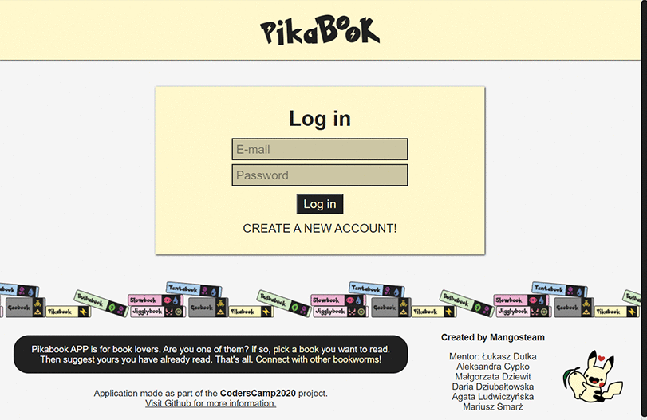

# CodersCamp 2020 - Projekt końcowy REACT
## **PikaBook** - Gotta read them all!

**Mangos Team** presents a system for books exchange. 

Where users can finally make their reader's dreams come true. All of us, the readers, are struggling with the same problem - after some time our bookshelves are full of volumes, series of books we've already read. As there are books we want to keep for life, there are some that were meant to be read only once (We feel sorry for them too). PikaBook can give them a second life! Our API allows you to find other people that are willing to adopt your unneeded books in exchange for readings they offers.

Open [DEMO](https://lukaszdutka.github.io/CodersCamp2020.Project.FullStack-Node-React.PikaBook-frontend/) to view it in the browser.

## Used technologies
- React APP
- React Testing Library
- Trello - for tasks management
- all others technologies used in our [backend project](https://github.com/lukaszdutka/CodersCamp2020.Project.FullStack-Node-React.PikaBook-backend)

## Our team 
* [Aleksandra Cypko](https://github.com/AleksandraCyp)
* [Agata Ludwiczyńska](https://github.com/AgataLudwiczynska) (UX/UI Designer)
* [Daria Dziubałtowska](https://github.com/daria305) (Tech Lead)
* [Małgorzata Dziewit](https://github.com/memeraki) (Develepment Manager)
* [Mariusz Smarż](https://github.com/mariusz-sm) (Business Owner)

Mentor: [Łukasz Dutka](https://github.com/lukaszdutka)

## API functionalities
 - creating a new account and logging in 
 - adding, removing and updating books in our collection 
 - book searching by title, author, genre or owner’s location
 - visiting other users’ profiles and browsing their collections
 - letting other users know that some books in their collections sparkled our interest: poke creation
 - initiating an exchange by creating a basket with books to be exchanged
 - basket list and changing basket status to keep track of the book exchange
 - list of all received/sent pokes
 - chat allowing direct communication between users
 - me view with information about the user

 Desktop screens|Mobile screens
:-------------------------:|:-------------------------:
  |  
